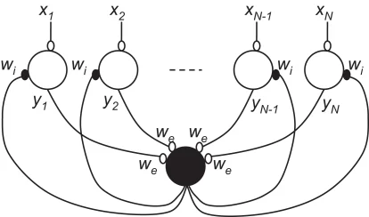

### Computational Neuroscience and Neuromorphic Computing Team (CoNNeCT) Lab — University of Sussex

This tutorial is part of a [series](https://genn-team.github.io/genn/documentation/5/tutorials/index.html) we have developed for users of our GeNN SNN simulator.

- Jamie Knight (J.C.Knight@sussex.ac.uk)
- Thomas Nowotny (T.Nowotny@sussex.ac.uk)


## 2026 CNEW TUTORIALS

## Tutorial — Training an SNN classifier inspired by the insect mushroom body
This tutorial is based around two Google collab notebooks. 
The [**Training collab**](https://colab.research.google.com/github/genn-team/genn/blob/master/docs/tutorials/mushroom_body/4_third_layer.ipynb) lets you train models on the MNIST training set and save the weights to your Google Drive.
The [**Testing collab**](https://colab.research.google.com/github/genn-team/genn/blob/master/docs/tutorials/mushroom_body/5_testing.ipynb) loads these weights and evaluates the model on the MNIST test set.

This morning, I spoke about how insects use a brain region called the mushroom body for visual learning. 
In this tutorial I'm going to demonstrate our GeNN SNN simulator by building a simple Mushroom Body and training it on MNIST (just like real insects do!)
The following exercises can all be done in Collab but, if you happen to have a laptop with a nice NVIDIA/AMD GPU, you can also install GeNN locally following the instructions at(https://github.com/genn-team/genn).
GeNN also has a reasonably comprehensive set of documentation to help you available [here](https://genn-team.github.io/genn/documentation/5/index.html).

### Exercises

**Task 0 — Explore the model**

Unlike real brains, it's very easy to access the state of simulated neurons so, to get started, let's plot some stuff!

- Plot some neuron variables, e.g. one of the Kenyon Cells.
  
  Hints:
    - Any variables of the running model reside on the GPU, you need to pull
      them to main memory to inspect or manipulate them:
      ```python
      input.vars["V"].pull_from_device()
      ```
    - Then, you can see and manipulate variables through two different
      interfaces:
        - ``input.vars["V"].values`` gives you access to a copy of the
          values currently in V.
        - ``input.vars["V"].view`` gives you direct access to the (C++
          allocated) memory of the model, so you could change variable
          values like so:
          ```python
          input.vars["V"].view[:] = 0
          input.vars["V"].push_to_device()
          ```
    - Be careful, if you decide to collect data to plot, only collect what you
      actually want to see; if you collect the voltage trace of 784 neurons over
      200 timesteps for 60000 examples, it will take a lot of memory. 

- Plot how the weight g of a few of the plastic synapses between the changes
  over time during learning.
  Hints:
    - There is already code in the notebook how to access the ``g`` values
    - Access them periodically and save them into a list

**Task 1 — Remove the supervision**

Although STDP is *generally* thought of as being an unsupervised learning rule, in the tutorial we forcefully removed it to ensure only the Mushroom Body Output Neuron (MBON) corresponding to the correct class fires.
Doing something slightly more realistic is probably not going to help the already questionable performance, _but_ since when has that stopped neuromorphic engineering!

1. Uncomment the ``//addToPost(g);`` line in the STDP rule so these plastic synapses actually inject currents
2. Build a Winner-take-All network between the MBON neurons. 
    - MBONs will need to excite inhibitory interneuron(s)
    - Inhibitory interneuron(s) will need to inhibit all MBONs


    
**Task 2 — Swarm of flies**

Similarly to when you run 'normal' ANN on GPUs, batching can really speed up SNNs when you use GeNN. See how much faster batching makes inference with this model.

Hints:
- One of our [other tutorials](https://genn-team.github.io/genn/documentation/5/tutorials/mnist_inference/tutorial_3.html) does something very similar with a simpler model.
